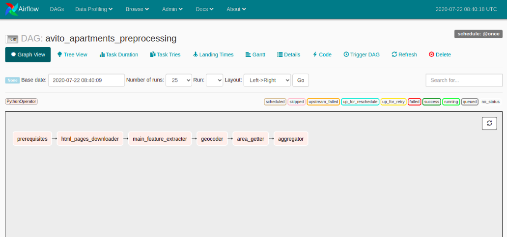
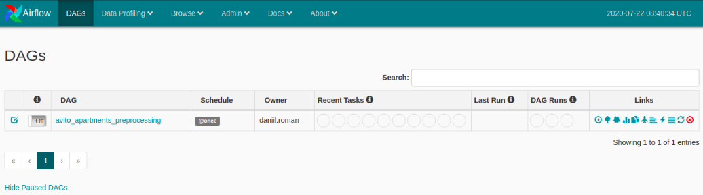
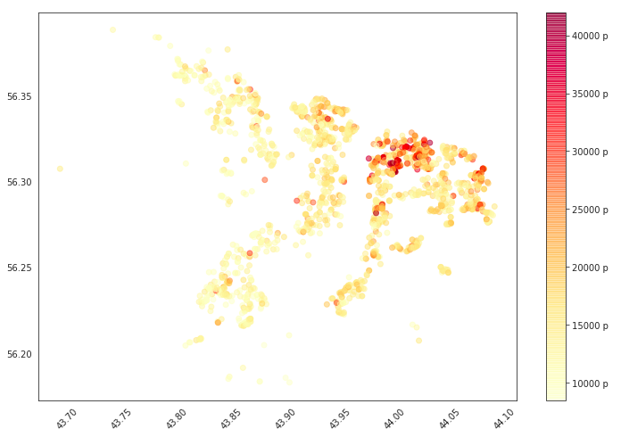
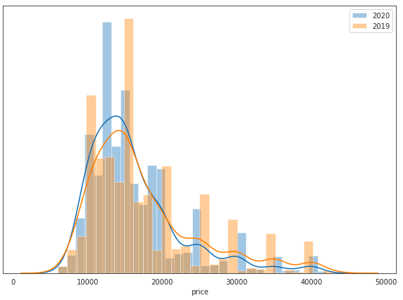
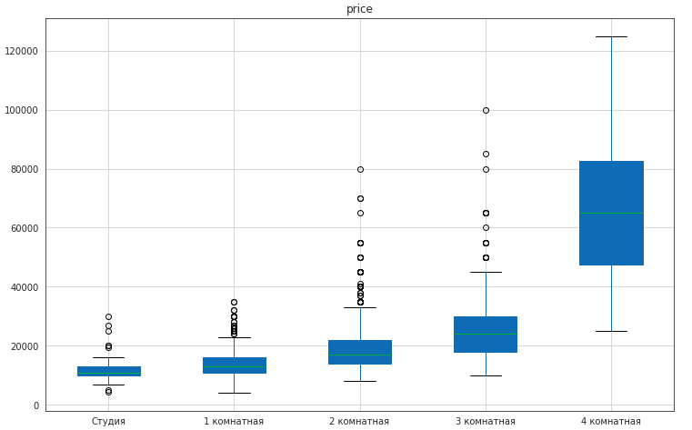

# Project for analyze rent of real estate at Nizhny Novgorod 
---
## Project has 2 part.
1. Web scraping and data processing.
2. Visualizing of basic statistics with assumptions.
---
## Data retrieval

Data has been scrabed from Avito.ru and enriached using `yandex geocoder` and `open street map`

For building ETL pipline `Airflow` has been used.

> for our purposes Airflow is overkill because we have just sequenced pipeline but for future it is convenient way to increase complexity and using  parallel processing

Data processing DAG located in [here](./dags/avito_data_processing.py) and looks like that:

### Airflow docker

For running airflow used docker-compose from [github.com/puckel](https://github.com/puckel/docker-airflow) with little bit changes for import necessary dependencies from requirements.txt

### Visualizing
[Jupyter notebook](./apartment_statistics.ipynb) with data analysis

#### and 2019 data analysis with some `machine learning` in [here](./flats_avito_2019.ipynb)

> final data in [here](./dags/avito) 